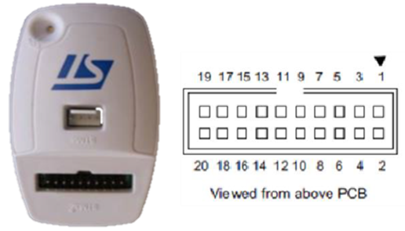

# stm32l0_pwrtest

This is a simple test program for experimenting with and verifying power management on STM32L0 boards.

## Setup with 4801

1. Attach an ST-LINK-2 to the SWD pins of the 4801 using jumpers.

   .

   | 4801 Pin |  Label | ST-Link Pin |
   |:--------:|:------:|:-----------:|
   |   JP1-1  |  +VDD  |      1      |
   |   JP1-2  |   GND  |      3      |
   |   JP1-3  | SWDCLK |      9      |
   |   JP1-4  | SWDIO  |      7      |
   |   JP1-5  |  nRST  |     15      |

   Note that these are almost linear; only 9 and 7 on the ST-Link are swapped.

2. Attach an Adafruit FT232H USB to TTL serial adapter.

   | 4801 Pin |  Label |    FT232H   |
   |:--------:|:------:|:-----------:|
   |   JP4-2  |   D0   |      D0     |
   |   JP4-3  |   D1   |      D1     |

3. Connect the serial adapter to PC via USB.  Ensure (in device manager) that the FTDI driver is creating a COM port. Use TeraTerm and open the COM port. In Setup>Serial, set speed to 115200. In `Setup>Terminal`:

   1. Set `New-line Receive:` to `LF`,
   2. Set `New-line Transmit:` to `CR+LF`,
   3. Make sure to check `Local echo`.

4. Attach power using a OTII box.

   | 4801 Pin |  Label |   OTII Pin  |
   |:--------:|:------:|:-----------:|
   |   JP6-1  |   GND  |     BLK     |
   |   JP6-2  |  +VDD  |     RED     |

5. Launch OTII software and set power to 3.3V, 200 mA limit.

